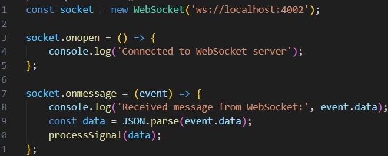

# Розробка додатку для візуалізації вимірювань LORAN

Мета роботи

Розробити додаток, який зчитує дані з емульованої вимірювальної частини LORAN, наданої у вигляді Docker image, та відображає положення об'єкта і базових станцій на графіку в декартових координатах.

Завантаження та запуск емулятора вимірювальної частини LORAN:

Завантажуємо Docker image з Docker Hub і запускаємо Docker контейнер:

